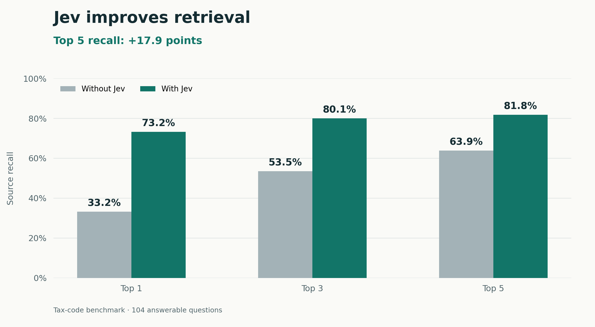

# Jevgraph

**Find the right evidence in your agent's memory graph.**

A CLI and agent skill for searching local documents and Notion snapshots with [Jev](https://docs.typesafe.ai/introduction). Results keep the original source passages and citations.

[Get started](#get-started) · [Agent skill](#agent-skill) · [Notion](#notion) · [Documentation](#documentation)



**Better ranking, with a tradeoff.** On one 8,851-node tax-code graph, top-five source recall rose from **63.9% to 81.8%**. Median cold lookup increased from **190 to 323 ms**, and estimated output tokens increased **2.2%**. This is a retrieval-quality result, not a speed or token-saving claim.

<details>
<summary>What the chart measures</summary>

The September 21, 2026 benchmark used 120 reviewed questions: 104 answerable and 16 unanswerable. Both modes used the same 20-candidate shortlist, five-result limit, and 6,000-character result budget. Recall is the average fraction of required source passages retrieved across answerable questions. The top-1 and top-3 bars are prefixes of the same run.

The graph covers 205 sections of 26 U.S.C., Subchapter B, from [OLRC release 119-99](https://uscode.house.gov/download/releasepoints/us/pl/119/99/usc-rp@119-99.htm). The semantic run used TypeSafe `jev-1.13.0`. All queries completed without errors. Both modes returned results for all 16 unanswerable questions. This single test does not establish generated-answer accuracy or recursive traversal quality. The corpus and experiment tooling are kept outside this distribution.

</details>

## Get started

Requires **Node.js 20+**, npm, and Git. No runtime dependencies.

Run the CLI from an existing local checkout:

```sh
node bin/jevgraph.js setup
```

Use **↑/↓ and Enter** to choose TypeSafe or OpenRouter, then paste your API key into the hidden prompt. Your key is saved in a private per-user configuration file, outside the graph.

Search a directory of Markdown files or a [JSON snapshot](docs/schema.md):

```sh
node bin/jevgraph.js search "Why did we choose this database?" --input ./memory
```

The release workflow is configured for npm trusted publishing with provenance. Registry installation instructions will be added only after a reviewed release is actually published.

<details>
<summary>Try the included example without a key</summary>

```sh
node bin/jevgraph.js search "Why PostgreSQL?" --input examples/memory.json --offline
node bin/jevgraph.js audit --input examples/memory.json
```

`--offline` uses local lexical ranking. Remove it after setup to use Jev.

</details>

## Agent skill

```sh
npx skills add ./skills/jevgraph --skill jevgraph
```

The [skill](skills/jevgraph/SKILL.md) teaches an agent how to retrieve evidence, inspect links, propose memory destinations, and handle Notion snapshots. It invokes the CLI above. Skill installation does not configure API keys or connect Notion.

## Commands

From the local checkout:

```sh
# Retrieve source passages
node bin/jevgraph.js search "What did we decide?" --input ./memory

# Propose where a new memory belongs
node bin/jevgraph.js place "We chose PostgreSQL for transactions" --input ./memory

# Audit explicit structure; add --semantic for Jev suggestions
node bin/jevgraph.js audit --input ./memory

# Follow existing links without a provider key
node bin/jevgraph.js traverse --input snapshot.json --from PAGE_A --to PAGE_B
```

Search finds lexical candidates and bounded graph neighbors, then Jev reranks them. Exact source evidence is retained. `place` and migration commands propose changes; they do not write to your graph. Use `node bin/jevgraph.js --help` for all commands.

## Notion

**Already have Notion MCP connected?** Ask your agent to fetch the relevant pages, content, and relations, then export a [normalized snapshot](docs/schema.md). Jevgraph searches that local file. It does not inherit the MCP host's OAuth credentials.

**Using Notion directly?** Supply `NOTION_TOKEN` in your environment, then run:

```sh
node bin/jevgraph.js notion snapshot --ids PAGE_ID --output snapshot.json
node bin/jevgraph.js search "What did we decide?" --input snapshot.json
```

The Notion adapter is read-only. Missing permissions, truncated content, and incomplete scope remain visible as warnings. [Notion setup and MCP handoff →](docs/notion.md)

## Configuration

- Interactive setup: `jevgraph setup`.
- Environment setup: export `TYPESAFE_API_KEY` or `OPENROUTER_API_KEY`, then run `jevgraph setup --from-env` to persist it.
- Diagnostics: `jevgraph config` and `jevgraph doctor` show redacted configuration.
- Cache: semantic scores are cached; `--no-cache` requests fresh scores.
- Local search: `--offline` explicitly selects lexical ranking.

Keys are never accepted as command-line arguments. Saved credentials use a `0600` file inside a `0700` directory. [Storage and provider options →](docs/setup.md)

## Documentation

- [Graph snapshot format and Markdown inputs](docs/schema.md)
- [Provider setup and credential storage](docs/setup.md)
- [Notion REST and MCP handoff](docs/notion.md)

Jev ranks a bounded candidate set; it cannot recover missing candidates or prove that evidence is sufficient. Model suggestions are not observed graph links. Partial snapshots remain partial. The current default does not guarantee no-answer rejection.

## License

Currently **UNLICENSED**. No open-source license is granted.
